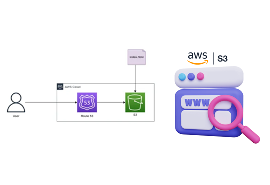

# Build and Launch a website on Amazon S3


## Introduction
Let's build together! In this tutorial, we will be deploying a beginner-friendly static website on AWS.

Launching a website is one of the most important thing for a company either it is a startup or a well established company. Let’s see how you can host a website using AWS with some easy steps.

## Let's get started
Let’s see how you can host a website using AWS with some easy steps:

- Step 1: Gathering the Basics:
        The most basic step is to first have a working AWS account and your front end code (.html file) which will be the content of your website. Don’t worry about the .html content even a basic <p>Hello World</p> can be made.

- Step 2: Create a S3 Bucket of your website
        To keep things simple we will be using only one AWS service to host our website that is AWS S3. AWS S3 in an storage service where all files are stored in S3 Buckets.

Login to your AWS account and choose S3 in search box.

After this when the S3 Dashboard opens, click on create bucket.

Then provide a globally unique name to your S3 Bucket and select the region you want your bucket to be in.

After clicking on Next, you will see a panel asking you to define some tags to your bucket, this is optional    since tags are just for your recognition of the bucket. You can skip this step by simply clicking on Next.

Once this is done, a new panel will come up where all the public access to your bucket is by default denied. But, since we are going to host a website which should be public so that everyone can see it.

To do this you need to un tick the check box. Once you untick it, a pop up will come warning you that the bucket is going to be public. So, don’t panic from it just check the acknowledgement box.

After this review your bucket and click on Create bucket.

- Step 3: Uploading file into your S3 Bucket
        Once the bucket is created, now it’s time to upload the .html file onto it. For this click on blue Upload button on the top right.

        Add your file and click on Next.

        After uploading the file click on Next

        Once you click on Next, under the Manage public permission select Grand public read access to this object, so that your website is publicly readable.

        At last select your S3 storage type, we choose the basic standard type. But, to reduce the cost you can choose any other type depending upon your needs.

        Now at the end just review the details and click on Upload.

        After these step you can see that our index.html file is successfully uploaded.

- Step 4: Configure the settings of your S3 Bucket
        To inform your S3 Bucket that you are going to use this for hosting your website, click on Properties tab.  After this select the Static Website hosting title and fill in your document name, error name is not required(can type 404.html).

        Next click on Permission tab, Now you’ll need to click on the “Bucket Policy” subsection. Here, you’ll be prompted to create a JSON object that contains the details of your bucket’s access permission policy.

        This part can be confusing. For now, I’ll just give you the JSON that will grant full public access to the files in your bucket. This will make the website publicly accessible.

        Paste this into the bucket policy editor shown above:

           ```bash
            {
                "Version":"2012-10-17",
                "Statement":
                    [
                        {
                            "Sid":"PublicReadForGetBucketObjects",
                            "Effect":"Allow","Principal":"*",
                            "Action":"s3:GetObject",
                            "Resource":"arn:aws:s3:::YOUR-BUCKET-NAME/*"
                        }
                      ]
            }
            ```
        
        In place of YOUR-BUCKET-NAME type your bucket name.

        Once this is done just click on Save and All Done! You have now successfully uploaded a simple static website on AWS S3.

- Step 5: Hosting your Website
          To access your site, go back to the “Overview” tab on S3 and click on your index document . You’ll get a slide-in menu with the link on your website.

          Copy and Paste the link on your browser and your website will be accessible.


